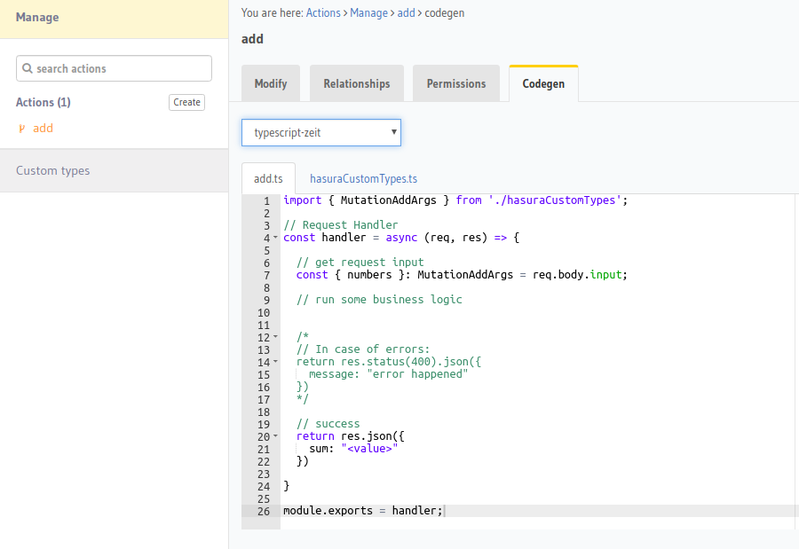

# Builder Kit for Hasura codegen

A repo and tutorial to help build new codegens for Hasura (CLI and console).

## Introduction

Currently, the Hasura CLI and console only do codegen for actions. This is roughly how actions codegen works:

1. `hasura actions codegen <action-name>` or the codegen tab on the console will invoke the codegen

	  CLI                                     |  Console
	  :--------------------------------------:|:------------------------------------------:
	    |  

2. This will invoke the codegen that was set in the `config.yaml` for the CLI, or the user selected dropdown in the console
3. Every actions codegen script accepts arguments:
  - `action-name`: The name of the action that you wish to codegen
  - `actions-sdl`: All the actions and custom types definition in [GraphQL SDL](https://alligator.io/graphql/graphql-sdl/)
  - `derive-payload`: When you derive an action from a Hasura mutation, this payload will be sent. In case of non-derived actions, this is `null`.

    The actions codegen script should return an array of files where file is a JSON object of the following format:

	  ```json
	  {
	    "name": "<filename>.<extension>",
	    "content": "<file content>"
	  }
	  ```

4. Example:

	  ```js
	  const templater = (actionName, actionsSdl, derive) => {

	    // your codegen logic

	    return [
	      {
	        name: "file1.js",
		content: 'console.log("This is an autogenerated file")'
	      },
	      {
	      	name: "file2.js",
		content: 'console.log("This is another autogenerated file")'
	      }
	    ]
	  }
	  ```
5. The hasura CLI or console then print the files in the directory or render the files and contents in the console UI respectively

## Run the sample codegen

We have setup a basic codegen (`actions-codegen.js`) in the `my-new-codegen` directory. To try it out:

1. Run the codegen for a simple action `addNumbers`
  ```
  cd tester
  npm i
  node tester addNumbers

  # View the output
  cat output/addNumbers.md
  ```
2. Run the codegen for an action deriving a Hasura mutation `updateEmail`
  ```
  cd tester
  npm i
  node tester updateEmail

  # View the output
  cat output/updateEmail.md
  ```

## Build your own codegen by modifying the `actions-codegen.js` script

Open up the `my-new-codegen/actions-codegen.js` file and start building your own codegen!

For reference, [check these codegen for `nodejs-zeit`](https://github.com/wawhal/actions-codegen/blob/master/nodejs-zeit/codegen.js).

Limitations:
- Because the codegen script is loaded dynamically, avoid loading external depedencies.
- These are the libraries that are currently available that you can `require()` in your codegen script:
  - graphql
  - @graphql-codegen/core
  - inflection
- Codegen scripts support ES6 (use `require` for loading dependencies instead of `import`)

## Publish your codegen for everyone so that it shows up in the CLI and the console

Let's say you have to add a new codegen for a framework called `my-new-framework`.

1. Clone [this repo](https://github.com/hasura/codegen-assets)
2. Edit `frameworks.json` to include your `{ "name": "my-new-codegen" }`
3. Create a new directory named `my-new-codegen` and add your codegen file to that directory as `actions-codegen.js`.

### Starter Kit (optional)

You can also include a starterkit for `my-new-framework`. Add the starter kit as a directory called `starter-kit` to the `my-new-codegen/` directory and edit `frameworks.json` to change `{"name": "my-new-framework"}` to `{"name": "my-new-framework", "hasStarterKit": true }`. 
